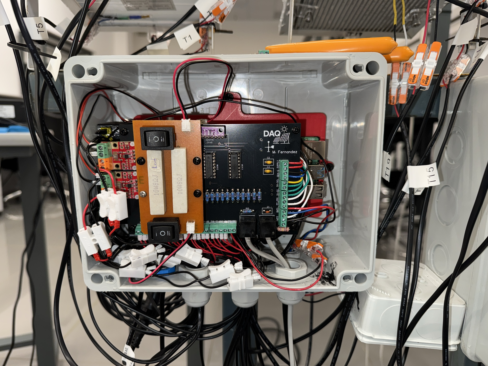
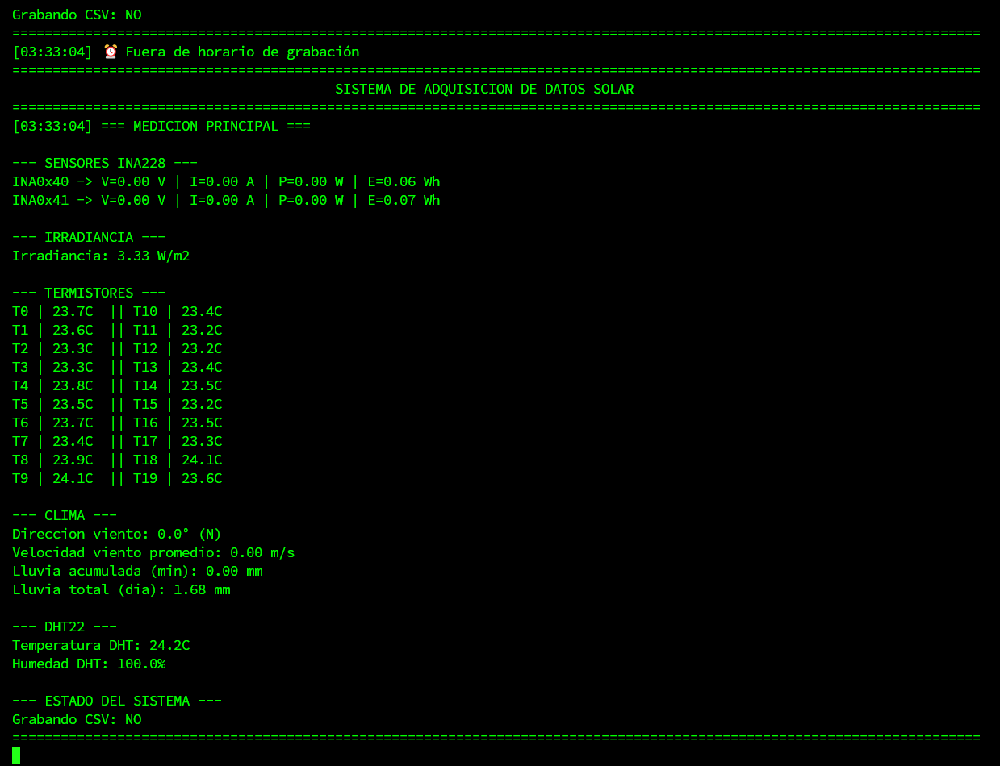
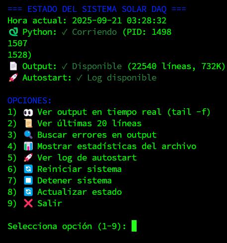
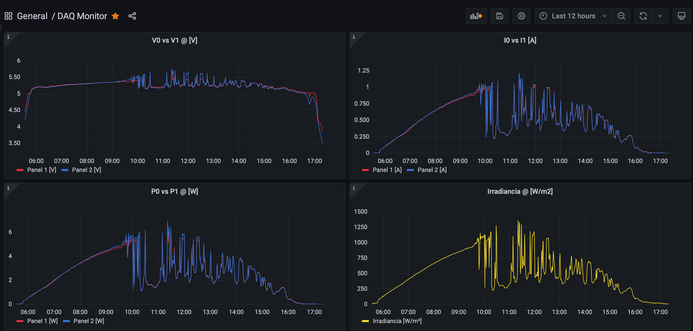
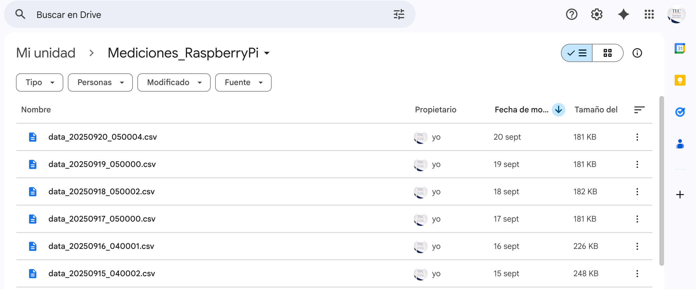

# Sistema de Adquisición de Datos para Paneles Solares

[](https://opensource.org/licenses/MIT)
[](https://doi.org/10.5281/zenodo.17563420)
[](https://www.python.org/downloads/)
[](https://github.com/psf/black)

## Resumen
Este proyecto implementa un sistema DAQ para dos paneles solares usando una Raspberry Pi 4. El sistema mide variables eléctricas y ambientales cada minuto, guarda archivos CSV diarios en la Pi y puede integrarse con InfluxDB, Grafana y Google Drive para monitoreo y respaldo.

## Sensores y Variables
- `2x INA228`: voltaje, corriente, potencia y energía de cada panel.
- `ADS1115 + Spektron 210`: irradiancia solar.
- `20x termistores NTC + 3x CD74HC4051`: temperatura en múltiples puntos del sistema.
- `DHT22`: temperatura y humedad ambiente.
- `Anemómetro`: velocidad del viento.
- `Veleta resistiva`: dirección del viento.
- `Pluviómetro`: precipitación acumulada.

## Flujo del Sistema
- Adquisición automática en horario operativo.
- Escritura de CSV diarios en `/home/pi/Desktop/Mediciones/`.
- Monitoreo local desde terminal y panel de control.
- Integración opcional con InfluxDB/Grafana y sincronización con Google Drive.

## Vista del Proyecto
| Hardware | Terminal de adquisición |
| --- | --- |
|  |  |

| Panel de control | Dashboard Grafana |
| --- | --- |
|  |  |

### Respaldo en la nube


## Instalación en Raspberry Pi 4
Asumiendo que el hardware ya está correctamente conectado y que la Raspberry Pi OS ya está lista:

```bash
cd /home/pi/Desktop
git clone https://github.com/IPrometheusI/solar_daq.git
cd solar_daq
sudo bash setup_repo.sh
systemctl status solar_daq.service
```

`setup_repo.sh` crea el entorno virtual `.venv`, instala `requirements.txt`, copia los scripts de `bashScripts/` a `/home/pi/` y registra el servicio `solar_daq.service` para arranque automático.

Si vas a usar InfluxDB, usa [`.env.example`](.env.example) como plantilla:

```bash
cp .env.example .env
nano .env
```

Completa `INFLUX_URL`, `INFLUX_TOKEN`, `INFLUX_ORG` e `INFLUX_BUCKET`, y luego usa esos valores en el entorno donde correrá el servicio. No subas `.env` al repositorio.

## Operación Rápida
```bash
sudo systemctl start solar_daq.service
sudo systemctl stop solar_daq.service
/home/pi/control_solar_daq.sh
tail -f /home/pi/solar_daq.log
```

## Cómo Citar
Si utilizas este software en tu investigación o proyecto, usa el DOI:

`10.5281/zenodo.17563420`

También puedes usar el archivo `CITATION.cff` incluido en el repositorio.

## Licencia
Este proyecto está licenciado bajo la **Licencia MIT**. Consulta [LICENSE](LICENSE) para más detalles.

Copyright (c) 2025 Maickol A. Fernandez Obando
